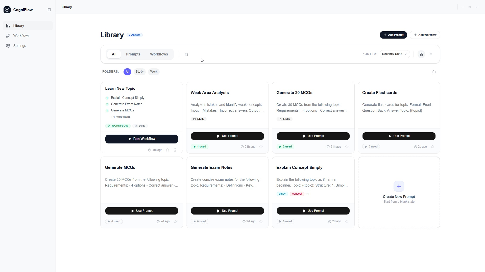

# CogniFlow

Workflow-first prompt management for AI power users.



CogniFlow is an open-source desktop application that helps organize prompts as reusable workflows instead of isolated pieces of text.

Most note-taking tools organize information as notes, documents, tasks, and lists. CogniFlow is designed for people who repeatedly use AI for learning, research, writing, coding, analysis, and other structured workflows.

---

## Why CogniFlow?

Prompts often end up scattered across:

* Chat history
* Notes
* Documents
* Bookmarks
* Text files

Over time it becomes difficult to:

* Find what worked before
* Reuse prompts consistently
* Organize related prompts
* Build repeatable workflows

CogniFlow solves this by organizing prompts into reusable workflow structures.

Example:

```text
Learn Topic

→ Explain Concept
→ Generate Notes
→ Create Flashcards
→ Generate MCQs
→ Review Weak Areas
```

---

## Features

### Workflow-First Organization

Organize prompts into reusable workflows instead of managing isolated prompts.

### Prompt Templates with Variables

Create reusable prompt templates using variables.

Example:

```text
Topic: {{topic}}
Difficulty: {{difficulty}}
Question Count: {{count}}
```

### Prompt History

Track changes and never lose previous versions of prompts.

### Prompt Reuse

Reuse the same prompt across multiple workflows.

### Usage Tracking

Discover your most-used prompts and workflows.

### Offline First

Built as a local-first desktop application.

Your data stays on your machine.

### Fast Search

Quickly find prompts and workflows when you need them.

---

## Technology Stack

* Vue 3
* TypeScript
* Rust
* Tauri
* SQLite

---

## Project Status

Early development.

Currently focused on:

* Prompt Management
* Workflow Management
* Prompt Variables
* Workflow Execution
* Offline Search

Future ideas include:

* Workflow Analytics
* Cross-AI Workflow Sharing
* Local AI Integration
---

## Philosophy

CogniFlow is based on a simple idea:

People do not think in prompts.

People think in workflows.

The goal is to make AI workflows easier to organize, reuse, and improve over time.

---

## Contributing

Contributions, ideas, feature requests, and feedback are welcome.

---

## License

MIT License
